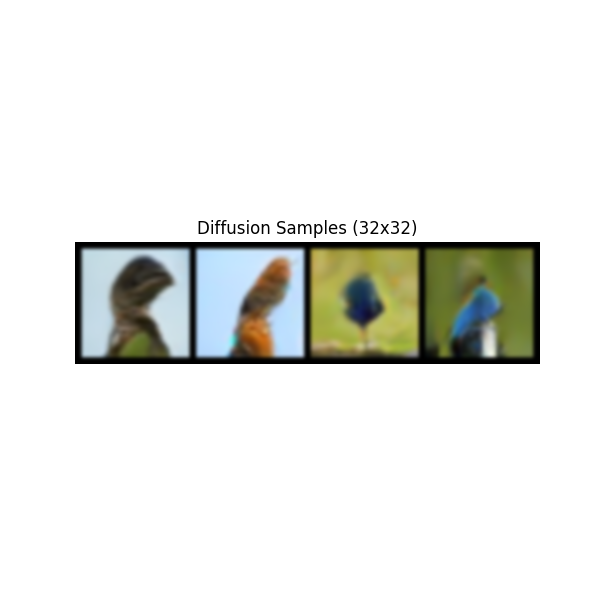
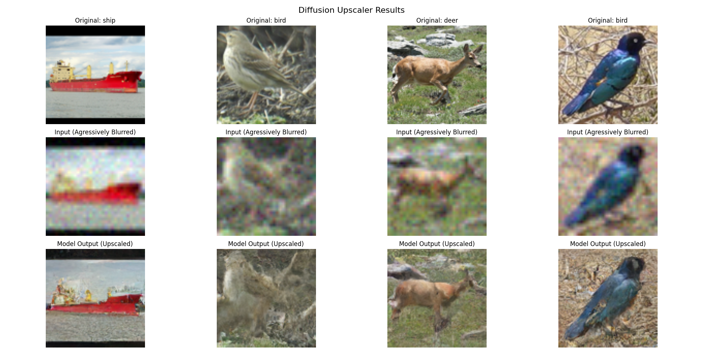
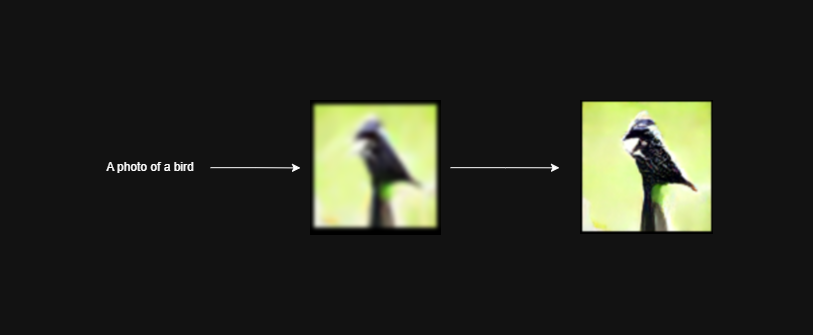
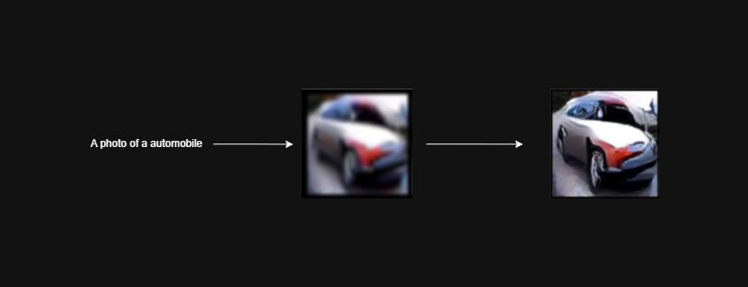
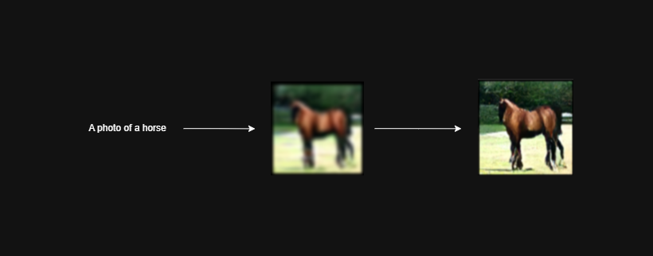
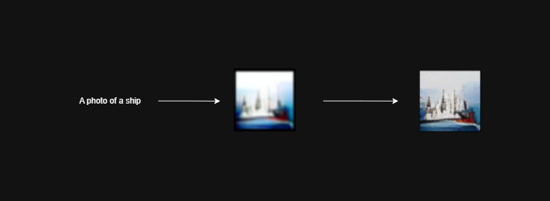
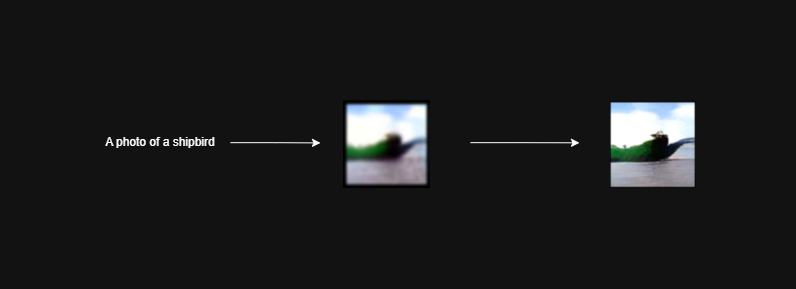
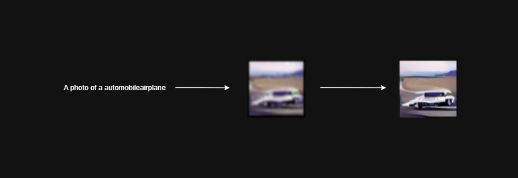

# Diffusion Models for Image Generation and Upscaling

#### This project implements diffusion models for image generation and upscaling, utilizing the powerful capabilities of PyTorch and Hugging Face's transformers library. The Repository includes code for training diffusion models on custom datasets, as well as pre-trained models for image generation and upscaling tasks.

#### Two different architectures are generating 96x96 resoluted images from texts: a UNet block based architecture for image generation and a ResNet block based architecture for image upscaling. In both architectures various techniques are been used to improve the performance of the models, such as attention mechanisms, positional encoding and noise scheduling. The training process involves optimizing the models using a combination of loss functions, including Mean Squared Error and Perceptual Loss.

*Installation:*

```bash
git clone https://github.com/EralpD/DiffusionModel_Text2ImgGenerator.git
python -m venv myenv
source myenv/bin/activate
```

```bash
pip install -r requirements.txt
```

### Training:

Generator model trained with [CIFAR-10](https://www.cs.toronto.edu/~kriz/cifar.html), Upscaler model trained with [STL-10](https://cs.stanford.edu/~acoates/stl10/) dataset. Generator/Upscaler has been trained for 100/50 epochs with a batch size of 128/32. 

*Generator:*

```bash
python train.py
```

- The model iterating its noise via *cosine noise scheduler*, 
  where $\bar{\alpha}_t = \frac{f(t)}{f(0)}$, $f(t) = \cos\left(\frac{t/T + s}{1 + s} \cdot \frac{\pi}{2}\right)^2$, and $\beta\_t = 1 - \frac{\bar{\alpha}\_t}{\bar{\alpha}\_{t-1}}$. The scheduler designed to produce smoother denoising and better sample quality. With forward process, the model learns to predict the noise added to the images at each time step, and with reverse process, it generates images by iteratively denoising the noise, as well as; $$x_t = \sqrt{\bar{\alpha}_t} \cdot x_0 + \sqrt{1 - \bar{\alpha}_t} \cdot \varepsilon, \quad \varepsilon \sim \mathcal{N}(0, I)$$.
  
  
- For text2image generation, CLIP text encoder encodes the text prompts for pass through to the model itself. Cross attention binds the text and noise features together, and it learns to generate images based on the text prompts. For cross attention, traditional cross attention has been used, as well as Group Normalization for normalization, and softmax for activation function has been used. All of cross attentions are implemented into U-Net architecture, which are very effective at bottom parts.

- The [U-Net architecture](https://www.geeksforgeeks.org/machine-learning/u-net-architecture-explained/), able model to differ complex relationships between noise and text features, also providing an efficient generation. The model is trained with a combination of Mean Squared Error (MSE) loss and Perceptual Loss (VGG16 loss), which additionally helps the model to generate images with better perceptual quality. The complexity of techniques avoids model from overfitting, and helps it to generalize better to unseen data.

- In the architecture, ResBlock layers are providing a local residual connection, to stabilize residual reasoning in local features. Both of ResBlocks and skip connections are able model to track, learn and generate better features via using their relationships, also using normalizations as Group Normalization. Self Attention Layers are used to capture long-range dependencies in the feature maps, and creates a connection between two ResBlocks. 

- [EMA (Exponential Moving Average)](https://en.wikipedia.org/wiki/Exponential_smoothing): $s_t = \alpha x_t + (1 - \alpha) s_{t-1}, \newline$ 
is a technique used to stabilize the training process and improve the quality of generated images. It maintains a moving average of the model's parameters, which can be used for evaluation and inference, providing better results compared to using the raw model parameters. Using EMA with a decay rate of 0.999, the model's parameters are updated in a way that gives more weight to recent updates while still considering the previous values.

- [DDIM sampling](https://arxiv.org/abs/2010.02502) is used for efficient image generation, allowing the model to generate high-quality images in fewer steps compared to traditional sampling methods. With [v-prediction](https://apxml.com/courses/advanced-diffusion-architectures/chapter-4-advanced-diffusion-training/advanced-loss-functions), directly helps to improve the quality of generated images by predicting the noise component at each step. In each sampling, EMA shadows the DDIM sampling process, providing better results compared to using the raw model parameters.

*Upscaler:*

```bash
python upscale.py
```

- Addition to the all techniques used in generator model, upscaler model also uses [FiLM conditioning](https://arxiv.org/abs/1709.07871): $\text{FiLM}(F) = \gamma \cdot F + \beta$. With scaling parameter ($\gamma$), and shifting parameter ($\beta$); FiLM adaptively modulate features, enabling precise detail enhancement for image upscaling.

### Testing:

*Generator:*

```bash
python test.py
```

and then write the text prompt of a class in CIFAR-10 dataset which will be generated by the model like,

```bash
a photo of a bird
```



<br>

*Upscaler:*

```bash
python testUpscale.py
```

with it, required components will be started to download. After that, upscaler model can be observed to upscale low-resolution images to higher resolutions, also with good quality even in complex situations:

<br>



<br>


### Results:

```bash
python .
```

- The pipeline demonstrates satisfactory performance. The text prompt → generator → upscaler architecture successfully produces 96×96 resolution images conditioned on arbitrary text prompts. The core objective of the project, learning a generative distribution from low-resolution training data and recovering high-frequency detail via super-resolution, is achieved effectively.

- Also, highly discovered that some samples aren't generated well, according to detail boundary of 32x32 images. Mean that the model is struggling to generate more comples images in conditions of that pixel information isn't enough. Although, the model is able to generate good quality images that aren't such as complex, like bird, frog, ship, etc. This indicates that model is learning to capture the underlying structure of the data, but may require further training or architectural adjustments (e.g., bigger pixel information, bigger and more detailed training dataset for generator, etc.) to improve performance on more complex samples.

<h4 align="center"> <strong>Classes (CIFAR-10):</strong> airplane, automobile, bird, cat, deer, dog, frog, horse, ship, truck. </h4>






- #### Also, by CLIP text encoder and cross attentions, we can generate multi-logical images with writing it unified:




### Conclusion:

#### This project demonstrates a complete and practical implementation of diffusion based generative modeling, combining text2image synthesis and super-resolution into a unified pipeline. By taking advantage of a U-Net–based generator and a ResNet based upscaler, along with techniques such as cosine noise scheduling, Cross Attention with CLIP embeddings, EMA stabilization, and DDIM sampling, the system is able to produce coherent and visually meaningful 96×96 images from textual prompts.

#### The results show that the model successfully learns the underlying data distribution of low-resolution datasets like CIFAR-10 and can enhance generated outputs through the upscaling stage. While performance is strong on structurally simpler classes, <u>limitations arise</u> when handling more complex visual compositions due to the inherent resolution constraints and dataset simplicity. This highlights a key insight: Diffusion models are highly sensitive to data richness and resolution, and their generative capacity scales with both.

#### Overall, the project assesses the <strong>effectiveness</strong> of combining diffusion models with conditioning mechanisms and post-processing architectures for improved image quality. It also provides a solid foundation for future improvements, such as training on higher-resolution datasets, incorporating more advanced conditioning strategies, or scaling the architecture for more detailed and diverse image generation tasks.

### References:
- Ho, J., Jain, A., & Abbeel, P. (2020). *Denoising Diffusion Probabilistic Models*  
  https://arxiv.org/abs/2006.11239  

- Nichol, A. Q., & Dhariwal, P. (2021). *Improved Denoising Diffusion Probabilistic Models*  
  https://arxiv.org/abs/2102.09672  

- Song, J., Meng, C., & Ermon, S. (2020). *Denoising Diffusion Implicit Models*  
  https://arxiv.org/abs/2010.02502  

- Radford, A., et al. (2021). *CLIP: Learning Transferable Visual Models From Natural Language Supervision*  
  https://arxiv.org/abs/2103.00020  

- Ronneberger, O., Fischer, P., & Brox, T. (2015). *U-Net: Convolutional Networks for Biomedical Image Segmentation*  
  https://arxiv.org/abs/1505.04597  

- He, K., Zhang, X., Ren, S., & Sun, J. (2015). *Deep Residual Learning for Image Recognition*  
  https://arxiv.org/abs/1512.03385  

- Vaswani, A., et al. (2017). *Attention Is All You Need*  
  https://arxiv.org/abs/1706.03762  

- Johnson, J., Alahi, A., & Fei-Fei, L. (2016). *Perceptual Losses for Real-Time Style Transfer and Super-Resolution*  
  https://arxiv.org/abs/1603.08155  

- Simonyan, K., & Zisserman, A. (2014). *Very Deep Convolutional Networks for Large-Scale Image Recognition*  
  https://arxiv.org/abs/1409.1556  

- Wu, Y., & He, K. (2018). *Group Normalization*  
  https://arxiv.org/abs/1803.08494  

- Perez, E., et al. (2017). *FiLM: Visual Reasoning with a General Conditioning Layer*  
  https://arxiv.org/abs/1709.07871  

- Kingma, D. P., & Welling, M. (2013). *Auto-Encoding Variational Bayes*  
  https://arxiv.org/abs/1312.6114  

- Krizhevsky, A. (2009). *CIFAR-10 Dataset*  
  https://www.cs.toronto.edu/~kriz/cifar.html  

- Coates, A., Ng, A. Y., & Lee, H. (2011). *STL-10 Dataset*  
  https://cs.stanford.edu/~acoates/stl10/ 

### License:

<strong>This project is licensed under the MIT License.</strong>
